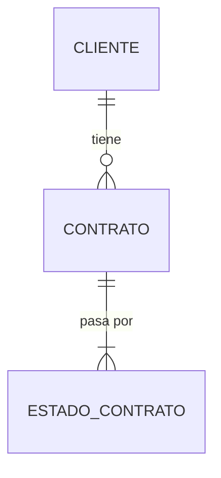

# Cómo Diseñé un Sistema de Base de Datos de Clase Empresarial Paso a Paso

## Introducción

Recientemente trabajé en el diseño completo de un **sistema de seguimiento de contratos con clientes**, desde el
análisis de requisitos hasta la implementación de un data warehouse. En este artículo, te llevaré paso a paso por todo
el proceso, explicando mis decisiones de diseño, los retos que enfrenté y las lecciones aprendidas.

Al final de este artículo, entenderás:

- Cómo pasar de requisitos de negocio a un modelo de datos completo
- Las diferencias prácticas entre OLTP y OLAP
- Por qué algunas decisiones de diseño importan más que otras
- Cómo implementar mejores prácticas de ingeniería de datos

---

## Paso 1: Entender el Problema (Análisis de Requisitos)

### El Desafío Inicial

El cliente necesitaba un sistema para:

- **Gestionar contratos** con clientes corporativos y gubernamentales
- **Rastrear el flujo de trabajo** desde que se crea un contrato hasta su finalización
- **Asignar recursos**: personal y equipos a cada contrato
- **Procesar muestras** (análisis de laboratorio) y guardar resultados
- **Generar reportes** ejecutivos y analíticos

### Mi Proceso de Análisis

**1. Hice las preguntas correctas:**
::field-group
::field{name="¿Qué información necesitan rastrear?" }
::

::field{name="¿Quiénes usarán el sistema y cómo?" }
::

::field{name="¿Qué reportes necesitan generar?" }
::

::field{name="¿Qué volúmenes de datos esperan?" }
::

::field{name="¿Necesitan historial de cambios?" }
::

::


**2. Identifiqué las entidades principales:**

Escuché palabras clave en la conversación:

- "**Clientes**" → Entidad principal
- "**Contratos**" → Acuerdos formales
- "**Estados**" → Workflow/ciclo de vida
- "**Personal**" → Recursos humanos
- "**Equipos**" → Recursos materiales
- "**Muestras**" → Lo que se procesa
- "**Análisis**" → Resultados del procesamiento


**3. Identifiqué dos necesidades distintas:**

Aquí fue donde tomé mi primera **decisión arquitectural importante**:

```
Necesidad Operacional (OLTP):
→ Crear/modificar contratos
→ Asignar recursos
→ Registrar muestras
→ Capturar análisis

Necesidad Analítica (OLAP):
→ ¿Cuántos contratos firmamos este mes?
→ ¿Qué clientes generan más ingresos?
→ ¿Cuál es el tiempo promedio de procesamiento?
→ ¿Qué personal es más productivo?
```

::alert{type="warning" title="Lección aprendida" description="No intentes hacer un solo modelo para todo. Las
necesidades transaccionales y analíticas requieren arquitecturas diferentes."}
::


---

## Paso 2: Crear el Modelo Conceptual

### ¿Por qué empezar aquí?

Muchos desarrolladores saltan directo al código o a crear tablas. **Eso es un error**. El modelo conceptual es como el
plano arquitectónico de una casa: te ayuda a visualizar la estructura antes de construir.

### Mi Proceso

**1. Listar todas las entidades:**

```
✓ Cliente
✓ Contrato
✓ Estado
✓ Estado_Contrato (relación)
✓ Personal
✓ Personal_Asignado (relación)
✓ Equipo
✓ Equipo_Asignado (relación)
✓ Tipo_Muestra
✓ Muestra
✓ Análisis
```

**2. Definir las relaciones:**

Aquí fue donde realmente entendí el dominio del negocio:

```
Cliente 1:N Contrato
→ Un cliente puede tener muchos contratos
→ Cada contrato pertenece a un solo cliente

Contrato 1:N Estado_Contrato
→ Un contrato pasa por múltiples estados
→ Cada cambio de estado pertenece a un contrato

Contrato N:M Personal (a través de Personal_Asignado)
→ Un contrato puede tener varios empleados
→ Un empleado puede trabajar en varios contratos

Muestra 1:N Análisis
→ Una muestra puede tener múltiples análisis
→ Cada análisis pertenece a una muestra
```

**3. Usar una herramienta visual:**

Elegí **Mermaid** para el diagrama ER porque:

- ✅ Es código (versionable en Git)
- ✅ Se renderiza automáticamente
- ✅ Es fácil de modificar
- ✅ No necesita software especializado



### Decisiones de Diseño en esta Fase

**Decisión 1: Tabla de relación para Estado_Contrato**

❌ **Opción rechazada**: Tener solo `contrato.estado_actual`

✅ **Opción elegida**: Tabla `estado_contrato` con historial completo

**¿Por qué?** El cliente mencionó "queremos saber cuánto tiempo estuvo en cada estado". Eso significa que necesitan *
*historial**, no solo el estado actual.

**Decisión 2: Tablas de asignación para Personal y Equipo**

❌ **Opción rechazada**: Foreign keys directas (`contrato.id_personal_principal`)

✅ **Opción elegida**: Tablas `personal_asignado` y `equipo_asignado`

**¿Por qué?**

- Un contrato puede tener múltiples personas (relación N:M)
- Necesitan rastrear fechas de asignación y devolución
- Cada asignación tiene sus propios atributos (rol, porcentaje dedicación)

::alert{type="warning" title="Lección aprendida" description="Si una relación tiene atributos propios, necesita su propia tabla."}
::

::card
---
title: Modelo conceptual
icon: i-simple-icons-github
to: https://github.com/raulanto/Sistema-de-Base-de-Datos-de-Clase-Empresarial/blob/main/Modelo%20conceptual%20de%20sistema%20de%20seguimientos%20de%20clientes.md
target: _blank
---
En cuentra el codigo completo del modelo conceptual en mi repositorio de GitHub.
::


---

## Paso 3: Crear el Modelo Lógico (OLTP)

### Objetivo de esta fase

Transformar el modelo conceptual en un esquema que pueda implementarse en una base de datos, pero aún **independiente
del SGBD específico**.

### Mi Proceso

**1. Convertir entidades en tablas con atributos completos:**

Para cada entidad, me pregunté:

- ¿Qué información específica necesito almacenar?
- ¿Qué tipo de datos es apropiado?
- ¿Qué constraints son necesarios?

Ejemplo con **Cliente**:

```sql
-- Análisis mental:
-- ¿Qué identifica un cliente? → RFC (en México)
-- ¿Cómo contactamos? → Email, teléfono
-- ¿Dónde están? → Dirección completa
-- ¿Tipos diferentes? → Corporativo, Gobierno, Individual
-- ¿Inactivos? → Flag de activo

CREATE TABLE cliente
(
    id_cliente          INTEGER PRIMARY KEY,
    nombre              VARCHAR(200) NOT NULL, -- ¿Cuántos caracteres? Busqué el nombre más largo típico
    rfc                 VARCHAR(13) UNIQUE,    -- En México: 12-13 caracteres
    email               VARCHAR(100) NOT NULL,
    telefono            VARCHAR(20),           -- Internacional: hasta 20 chars
    direccion           TEXT,                  -- Longitud variable
    ciudad              VARCHAR(100),
    estado              VARCHAR(50),
    codigo_postal       VARCHAR(10),
    tipo_cliente        VARCHAR(50),           -- Después lo convertiré a ENUM
    activo              BOOLEAN   DEFAULT TRUE,
    fecha_registro      TIMESTAMP DEFAULT CURRENT_TIMESTAMP,
    fecha_actualizacion TIMESTAMP
);
```

**2. Aplicar normalización:**

Identifiqué oportunidades de normalización:

**Antes (desnormalizado - ❌):**

```sql
CREATE TABLE muestra
(
    .
    .
    .
    tipo_muestra
    VARCHAR
(
    100
),
    descripcion_tipo TEXT,
    tiempo_procesamiento INTEGER
    );
```

**Después (normalizado - ✅):**

```sql
-- Catálogo separado
CREATE TABLE tipo_muestra
(
    id_tipo_muestra           INTEGER PRIMARY KEY,
    nombre                    VARCHAR(100) UNIQUE,
    descripcion               TEXT,
    tiempo_procesamiento_dias INTEGER
);

-- Muestra solo referencia
CREATE TABLE muestra
(
    .
    .
    .
    id_tipo_muestra
    INTEGER
    REFERENCES
    tipo_muestra
);
```

**¿Por qué normalizar?**

- Evita inconsistencias ("Agua Potable" vs "agua potable" vs "AGUA POTABLE")
- Facilita actualizaciones (cambio en un lugar)
- Ahorra espacio
- Mantiene integridad referencial

**3. Definir constraints críticos:**

Aquí es donde apliqué **reglas de negocio** como código:

```sql
-- Regla: La fecha de fin debe ser posterior al inicio
CONSTRAINT chk_fechas CHECK (fecha_fin >= fecha_inicio)

-- Regla: El monto debe ser positivo
CONSTRAINT chk_monto CHECK (monto_total > 0)

-- Regla: El email debe tener formato válido
CONSTRAINT chk_email CHECK (email LIKE '%@%')

-- Regla: Solo estados válidos
CONSTRAINT chk_estado_equipo CHECK (
    estado_equipo IN ('Disponible', 'En Uso', 'Mantenimiento', 'Baja')
)
```

**4. Planear los índices:**

No creé todos los índices aún, pero identifiqué qué queries serían frecuentes:

```sql
-- Query frecuente: "Buscar contratos de un cliente"
CREATE INDEX idx_contrato_cliente ON contrato (id_cliente);

-- Query frecuente: "Buscar estado actual de un contrato"
CREATE INDEX idx_estado_contrato_actual
    ON estado_contrato (id_contrato, es_estado_actual) WHERE es_estado_actual = TRUE;

-- Query frecuente: "Muestras por fecha de entrada"
CREATE INDEX idx_muestra_fecha ON muestra (fecha_entrada);
```

### Decisiones de Diseño en esta Fase

**Decisión 3: ¿Un solo estado actual o tabla histórica?**

Implementé **ambos**:

```sql
CREATE TABLE estado_contrato
(
    .
    .
    .
    es_estado_actual
    BOOLEAN
    DEFAULT
    TRUE
);

-- Solo UN registro puede tener es_estado_actual = TRUE
CREATE UNIQUE INDEX idx_unico_estado_actual
    ON estado_contrato (id_contrato) WHERE es_estado_actual = TRUE;
```

**¿Por qué?**

- Queries simples cuando solo necesitas el estado actual
- Historial completo disponible para análisis
- Trigger automático para marcar el anterior como FALSE

**Decisión 4: Campos de auditoría en todas las tablas**

```sql
fecha_creacion
TIMESTAMP DEFAULT CURRENT_TIMESTAMP,
fecha_actualizacion TIMESTAMP DEFAULT CURRENT_TIMESTAMP
```

**¿Por qué?** En proyectos empresariales, SIEMPRE necesitas saber:

- ¿Cuándo se creó este registro?
- ¿Cuándo fue la última modificación?
- ¿Quién hizo el cambio? (agregué `creado_por`, `modificado_por`)

::alert{type="info" title="Lección aprendida" description="Es 100x más fácil agregar auditoría desde el inicio que intentar reconstruir historial después."}
::


::card
---
title: Modelo logico
icon: i-simple-icons-github
to: https://github.com/raulanto/Sistema-de-Base-de-Datos-de-Clase-Empresarial/blob/main/MODELO%20L%C3%93GICO%20-%20SISTEMA%20DE%20SEGUIMIENTO%20DE%20CLIENTES.sql
target: _blank
---
En cuentra el codigo completo del modelo lógico en mi repositorio de GitHub.
::


---

## Paso 4: Crear el Modelo Físico (PostgreSQL)

### ¿Por qué PostgreSQL?

Elegí PostgreSQL sobre MySQL o SQL Server porque:

- ✅ **Tipos de datos avanzados**: JSONB, Arrays, INET
- ✅ **Full-text search nativo**: No necesito Elasticsearch para búsquedas básicas
- ✅ **Extensibilidad**: PostGIS, pg_cron, etc.
- ✅ **Índices avanzados**: GIN, BRIN, Partial indexes
- ✅ **Open source y maduro**

### Mi Proceso

**1. Organizar en esquemas:**

```sql
CREATE SCHEMA core; -- Tablas principales
CREATE SCHEMA catalog; -- Catálogos/referencias
CREATE SCHEMA audit; -- Logs de auditoría
CREATE SCHEMA analytics; -- Vistas para reportes
```

**¿Por qué esquemas separados?**

- Organización lógica clara
- Permisos granulares por esquema
- Facilita el backup selectivo
- Mejora la seguridad

**2. Usar características específicas de PostgreSQL:**

**SERIAL vs BIGSERIAL:**

```sql
-- Para tablas que crecerán mucho
CREATE TABLE muestra
(
    id_muestra BIGSERIAL PRIMARY KEY -- hasta 9 quintillones
);

-- Para catálogos pequeños
CREATE TABLE estado
(
    id_estado SERIAL PRIMARY KEY -- hasta 2 mil millones
);
```

**JSONB para flexibilidad:**

```sql
CREATE TABLE equipo
(
    .
    .
    .
    especificaciones
    JSONB -- Diferentes equipos tienen specs diferentes
);

-- Permite queries como:
SELECT *
FROM equipo
WHERE especificaciones ->>'voltaje' = '220V';
```

**Campos generados:**

```sql
nombre_completo
VARCHAR(302) GENERATED ALWAYS AS 
    (nombre || ' ' || apellido_paterno || ' ' || COALESCE(apellido_materno, '')) 
STORED
```

¿Por qué? Evita inconsistencias y simplifica queries.

**Validación con regex:**

```sql
CONSTRAINT chk_email CHECK (
    email ~* '^[A-Za-z0-9._%+-]+@[A-Za-z0-9.-]+\.[A-Za-z]{2,}$'
)
```

Mucho más robusto que `email LIKE '%@%'`.

**3. Implementar triggers para automatización:**

**Trigger 1: Actualizar fecha_actualizacion automáticamente**

```sql
CREATE
OR REPLACE FUNCTION actualizar_fecha_modificacion()
RETURNS TRIGGER AS $$
BEGIN
    NEW.fecha_actualizacion
= NOW();
RETURN NEW;
END;
$$
LANGUAGE plpgsql;

CREATE TRIGGER trg_contrato_actualizar
    BEFORE UPDATE
    ON contrato
    FOR EACH ROW
    EXECUTE FUNCTION actualizar_fecha_modificacion();
```

**Trigger 2: Mantener solo un estado actual**

```sql
CREATE
OR REPLACE FUNCTION mantener_estado_unico()
RETURNS TRIGGER AS $$
BEGIN
    IF
NEW.es_estado_actual = TRUE THEN
UPDATE estado_contrato
SET es_estado_actual = FALSE
WHERE id_contrato = NEW.id_contrato
  AND id_estado_contrato != NEW.id_estado_contrato;
END IF;
RETURN NEW;
END;
$$
LANGUAGE plpgsql;
```

**Trigger 3: Actualizar estado de equipo al asignar**

```sql
CREATE TRIGGER trg_equipo_asignacion
    AFTER INSERT
    ON equipo_asignado
    FOR EACH ROW
    EXECUTE FUNCTION actualizar_estado_equipo();
```

**¿Por qué triggers?**

- Garantizan reglas de negocio a nivel de base de datos
- Funcionan incluso si hay múltiples aplicaciones
- No dependen del código de la aplicación

::alert{type="warning" title="Lección aprendida" description="Los triggers pueden hacer el debugging más difícil. Úsalos
solo para lógica crítica."}
::

**4. Optimización de índices:**

**Índice regular:**

```sql
CREATE INDEX idx_contrato_cliente ON contrato (id_cliente);
```

**Índice parcial (solo registros activos):**

```sql
CREATE INDEX idx_cliente_activo
    ON cliente (activo) WHERE activo = TRUE;
```

**Índice GIN para búsqueda full-text:**

```sql
CREATE INDEX idx_cliente_busqueda
    ON cliente
    USING gin(to_tsvector('spanish', nombre || ' ' || COALESCE (rfc, '')));
```

**Índice GIN para JSONB:**

```sql
CREATE INDEX idx_equipo_especificaciones
    ON equipo
    USING gin(especificaciones);
```

**Índice multicolumna para queries complejos:**

```sql
CREATE INDEX idx_estado_contrato_actual
    ON estado_contrato (id_contrato, es_estado_actual) WHERE es_estado_actual = TRUE;
```

**5. Agregar datos semilla (seeds):**

```sql
INSERT INTO catalog.estado (nombre_estado, descripcion, orden_secuencia, color_hex)
VALUES ('Nuevo', 'Contrato recién creado', 1, '#3498db'),
       ('En Revisión', 'En proceso de revisión', 2, '#f39c12'),
       ('Aprobado', 'Aprobado, pendiente firma', 3, '#2ecc71'), ...
```

Esto permite que el sistema funcione inmediatamente después de la instalación.


### Decisiones de Diseño en esta Fase

**Decisión 5: Particionamiento preparado pero no implementado**

Dejé comentado el código de particionamiento:

```sql
-- CREATE TABLE contrato_2024 PARTITION OF contrato
--     FOR VALUES FROM ('2024-01-01') TO ('2025-01-01');
```

**¿Por qué?**

- El particionamiento tiene overhead
- Solo vale la pena con millones de registros
- Es más fácil agregarlo después que quitarlo

**Decisión 6: Tabla de auditoría separada vs triggers en cada tabla**

Opté por una tabla central de auditoría:

```sql
CREATE TABLE audit.cambios_log
(
    tabla            VARCHAR(100),
    operacion        VARCHAR(10),
    datos_anteriores JSONB,
    datos_nuevos     JSONB,
    usuario          VARCHAR(100),
    fecha_cambio     TIMESTAMPTZ
);
```

**¿Por qué?**

- Un solo lugar para buscar cambios
- Fácil de consultar y generar reportes
- No requiere modificar cada tabla


::card
---
title: Modelo Fisico
icon: i-simple-icons-github
to: https://github.com/raulanto/Sistema-de-Base-de-Datos-de-Clase-Empresarial/blob/main/MODELO%20F%C3%8DSICO%20-%20IMPLEMENTACI%C3%93N%20POSTGRESQL.sql
target: _blank
---
En cuentra el codigo completo del modelo Fisico en mi repositorio de GitHub.
::

---

## Paso 5: Crear el Modelo Dimensional (Data Warehouse)

### El Gran Cambio Mental

Aquí es donde todo cambia. Pasamos de "diseño para escribir datos" a "diseño para leer datos rápidamente".

### Diferencias OLTP vs OLAP

```
OLTP (Transaccional):
✓ Normalizado (3FN)
✓ Muchas tablas pequeñas
✓ JOINs complejos
✓ Escrituras frecuentes
✓ Queries simples pero muchos
✗ Análisis complejos lentos

OLAP (Analítico):
✓ Desnormalizado (Star Schema)
✓ Pocas tablas grandes
✓ JOINs simples
✓ Escrituras en batch (ETL)
✓ Queries complejos pero optimizados
✗ No apto para transacciones
```

### Mi Proceso

**1. Identificar dimensiones:**

Las dimensiones responden a las preguntas: **¿Quién? ¿Qué? ¿Dónde? ¿Cuándo?**

```
dim_cliente    → ¿Quién contrató?
dim_personal   → ¿Quién trabajó?
dim_estado     → ¿En qué estado?
dim_tipo_muestra → ¿Qué tipo de análisis?
dim_ubicacion  → ¿Dónde?
dim_tiempo     → ¿Cuándo? (¡La más importante!)
```

**2. Crear la dimensión tiempo:**

Esta es **la dimensión más poderosa** en cualquier DWH:

```sql
CREATE TABLE dim_tiempo
(
    sk_tiempo      SERIAL PRIMARY KEY,
    fecha          DATE NOT NULL UNIQUE,

    -- Jerarquía temporal
    anio           INTEGER,
    trimestre      INTEGER,
    mes            INTEGER,
    semana_anio    INTEGER,
    dia_mes        INTEGER,
    dia_semana     INTEGER,

    -- Nombres para reportes
    nombre_mes     VARCHAR(20), -- "Octubre"
    nombre_dia     VARCHAR(20), -- "Sábado"
    anio_mes       VARCHAR(7),  -- "2024-10"
    anio_trimestre VARCHAR(7),  -- "2024-Q4"

    -- Banderas útiles
    es_fin_semana  BOOLEAN,
    es_festivo     BOOLEAN,
    nombre_festivo VARCHAR(100),
    es_dia_laboral BOOLEAN
);
```

**¿Por qué una tabla solo para fechas?**

Permite queries como:

```sql
-- Ventas por día de la semana
SELECT nombre_dia, SUM(monto)
FROM fact_contrato fc
         JOIN dim_tiempo dt ON fc.sk_fecha_inicio = dt.sk_tiempo
GROUP BY nombre_dia;

-- Solo días laborales del Q4
SELECT *
FROM dim_tiempo
WHERE anio = 2024
  AND trimestre = 4
  AND es_dia_laboral = TRUE;
```

**3. Implementar SCD Tipo 2 (Slowly Changing Dimensions):**

Problema: Si un cliente cambia de dirección, ¿cómo mantengo el historial?

Solución: **SCD Tipo 2**

```sql
CREATE TABLE dim_cliente
(
    sk_cliente   SERIAL PRIMARY KEY, -- Surrogate Key (artificial)
    id_cliente   INTEGER NOT NULL,   -- Natural Key (del OLTP)
    nombre       VARCHAR(200),
    ciudad       VARCHAR(100),

    -- SCD Tipo 2 fields
    fecha_inicio DATE    NOT NULL,
    fecha_fin    DATE    DEFAULT '9999-12-31',
    es_actual    BOOLEAN DEFAULT TRUE,
    version      INTEGER DEFAULT 1
);
```

Ejemplo de cómo funciona:

```sql
-- Cliente 123 inicialmente en Ciudad de México
INSERT INTO dim_cliente
VALUES (1, 123, 'ACME Corp', 'CDMX', '2023-01-01', '9999-12-31', TRUE, 1);

-- Se muda a Guadalajara el 2024-06-01
-- 1. Cerrar registro anterior
UPDATE dim_cliente
SET fecha_fin = '2024-05-31',
    es_actual = FALSE
WHERE sk_cliente = 1;

-- 2. Crear nuevo registro
INSERT INTO dim_cliente
VALUES (2, 123, 'ACME Corp', 'Guadalajara', '2024-06-01', '9999-12-31', TRUE, 2);
```

Ahora puedo analizar:

- Contratos por ciudad donde estaba el cliente EN ESE MOMENTO
- Cómo cambió la distribución geográfica de clientes

**4. Diseñar tablas de hechos:**

Las tablas de hechos contienen **métricas** (números) y **foreign keys** a dimensiones.

```sql
CREATE TABLE fact_contrato
(
    sk_contrato        BIGSERIAL PRIMARY KEY,

    -- Foreign keys a dimensiones
    sk_cliente         INTEGER REFERENCES dim_cliente,
    sk_fecha_inicio    INTEGER REFERENCES dim_tiempo,
    sk_fecha_fin       INTEGER REFERENCES dim_tiempo,
    sk_estado_actual   INTEGER REFERENCES dim_estado,

    -- Métricas aditivas (se pueden sumar)
    monto_total        NUMERIC(15, 2),
    cantidad_personal  INTEGER,
    cantidad_muestras  INTEGER,

    -- Métricas semi-aditivas (no siempre se suman)
    duracion_dias      INTEGER,

    -- Métricas derivadas
    monto_promedio_dia NUMERIC(12, 2)
);
```

**Tipos de tablas de hechos que creé:**

1. **Transaction Fact**: `fact_contrato`

    - Un registro = un contrato
    - Se carga una vez y raramente cambia
2. **Event Fact**: `fact_estado_contrato`

    - Un registro = un cambio de estado
    - Crece con cada evento
3. **Accumulating Snapshot**: `fact_equipo_uso`

    - Un registro = ciclo de vida completo
    - Se actualiza conforme avanza el proceso

**5. Pre-agregar datos frecuentemente consultados:**

```sql
CREATE
MATERIALIZED VIEW agg_contratos_mes AS
SELECT dt.anio,
       dt.mes,
       dc.tipo_cliente,
       COUNT(*)              as cantidad_contratos,
       SUM(fc.monto_usd)     as ingresos_totales,
       AVG(fc.duracion_dias) as duracion_promedio
FROM fact_contrato fc
         JOIN dim_tiempo dt ON fc.sk_fecha_inicio = dt.sk_tiempo
         JOIN dim_cliente dc ON fc.sk_cliente = dc.sk_cliente
GROUP BY dt.anio, dt.mes, dc.tipo_cliente;
```

**¿Por qué vistas materializadas?**

- Dashboards ejecutivos hacen las MISMAS queries todo el tiempo
- Pre-calcular es 100-1000x más rápido
- Se refrescan en batch (horario, diario)

### Decisiones de Diseño en esta Fase

**Decisión 7: Star Schema vs Snowflake Schema**

Elegí **Star Schema** (estrella) sobre Snowflake (copo de nieve):

```
Star Schema (elegido):
[dim_cliente] ← [fact_contrato] → [dim_tiempo]
                       ↓
                  [dim_estado]

✅ JOINs simples
✅ Queries más rápidos
✅ Más fácil de entender
❌ Algo de redundancia
```

**Decisión 8: Surrogate Keys vs Natural Keys**

Usé **surrogate keys** (llaves artificiales):

```sql
sk_cliente
SERIAL  -- Surrogate (generada automáticamente)
vs
id_cliente INTEGER -- Natural (viene del OLTP)
```

**¿Por qué?**

- Independencia entre OLTP y OLAP
- SCD Tipo 2 requiere múltiples registros del mismo id_cliente
- Performance (INTEGER es más rápido que VARCHAR)

::card
---
title: Modelo Dimensional
icon: i-simple-icons-github
to: https://github.com/raulanto/Sistema-de-Base-de-Datos-de-Clase-Empresarial/blob/main/MODELO%20DIMENSIONAL%20-%20DATA%20WAREHOUSE.sql
target: _blank
---
En cuentra el codigo completo del modelo Dimensional en mi repositorio de GitHub.
::


---

## Paso 6: Diseñar el Proceso ETL

### ¿Qué es ETL?

**E**xtract - **T**ransform - **L**oad

Es el puente entre tu base de datos operacional (OLTP) y tu data warehouse (OLAP).

### Mi Proceso

**1. Extract (Extraer):**

Necesito identificar qué datos son nuevos o han cambiado:

```sql
-- Contratos modificados hoy
SELECT *
FROM core.contrato
WHERE fecha_actualizacion::date >= CURRENT_DATE - 1;

-- Estados nuevos
SELECT *
FROM core.estado_contrato
WHERE fecha_cambio >= CURRENT_TIMESTAMP - INTERVAL '1 day';
```

**Técnicas que consideré:**

- **Incremental basado en timestamp** (elegido para MVP)
- **CDC (Change Data Capture)** con Debezium (para producción)
- **Full reload** (solo para catálogos pequeños)

**2. Transform (Transformar):**

Aquí es donde sucede la magia:

```sql
-- Convertir monedas a USD estándar
monto_usd
= CASE 
    WHEN moneda = 'MXN' THEN monto_total / tipo_cambio_mxn
    WHEN moneda = 'EUR' THEN monto_total * tipo_cambio_eur
    ELSE monto_total
END

-- Calcular métricas derivadas
duracion_dias
= fecha_fin - fecha_inicio

-- Limpiar datos
nombre_limpio = TRIM(UPPER(nombre))

-- Categorizar
categoria_monto = CASE
    WHEN monto < 50000 THEN 'Pequeño'
    WHEN monto < 200000 THEN 'Mediano'
    ELSE 'Grande'
END
```

**3. Load (Cargar):**

Carga en el orden correcto:

```
1º Dimensiones (sin dependencias)
   → dim_tiempo
   → dim_estado
   
2º Dimensiones SCD Tipo 2
   → dim_cliente
   → dim_personal
   
3º Tablas de hechos
   → fact_contrato
   → fact_muestra
   → fact_analisis
   
4º Vistas materializadas
   → REFRESH MATERIALIZED VIEW agg_contratos_mes
```

**4. Orquestación con Apache Airflow:**

```python
from airflow import DAG
from airflow.operators.postgres_operator import PostgresOperator

dag = DAG(
    'etl_contratos_diario',
    schedule_interval='0 2 * * *',  # 2 AM diario
    catchup=False
)

# Task 1: Extraer cambios
extract = PostgresOperator(
    task_id='extract_changes',
    sql='sql/extract_contratos.sql',
    dag=dag
)

# Task 2: Cargar dimensiones
load_dims = PostgresOperator(
    task_id='load_dimensions',
    sql='sql/load_dimensions.sql',
    dag=dag
)

# Task 3: Cargar hechos
load_facts = PostgresOperator(
    task_id='load_facts',
    sql='sql/load_facts.sql',
    dag=dag
)

# Task 4: Refrescar agregados
refresh = PostgresOperator(
    task_id='refresh_aggregates',
    sql='SELECT dwh.refresh_all_materialized_views()',
    dag=dag
)

# Definir dependencias
extract >> load_dims >> load_facts >> refresh
```

### Decisiones de Diseño en ETL

**Decisión 9: ETL vs ELT**

Elegí **ETL tradicional**:

- Transform ANTES de cargar
- Transformaciones en Python/SQL
- Carga datos ya limpios al DWH

Alternativa moderna: **ELT**

- Cargar datos raw primero
- Transform usando dbt en el DWH
- Más flexible pero requiere más recursos en el DWH

**Decisión 10: Frecuencia de carga**

```
Dimensiones lentas: Diario
Facts transaccionales: Cada hora
Facts de eventos: Near real-time (CDC)
Agregados: Nocturnos (2 AM)

```

---


## Paso 7: Implementar Mejores Prácticas

### Las 10 Mejores Prácticas que Apliqué

**1. Separación OLTP/OLAP**

```
✓ OLTP optimizado para escritura
✓ OLAP optimizado para lectura
✓ ETL conecta ambos
✓ Equipos diferentes pueden trabajar independientemente
```

**2. Nomenclatura consistente**

```sql
-- Singular para tablas
CREATE TABLE cliente
(
    .
    .
    .
);
✓
CREATE TABLE clientes
(
    .
    .
    .
);
✗

-- Prefijos claros
id_cliente      -- Primary key
sk_cliente      -- Surrogate key
fk_cliente      -- Foreign key
idx_tabla_columna  -- Índices
```

**3. Documentación inline**

```sql
COMMENT
ON TABLE core.contrato IS 
'Almacena contratos de servicios con clientes';

COMMENT
ON COLUMN core.contrato.monto_total IS 
'Valor total del contrato en la moneda especificada';
```

**4. Versionado de esquema**

```
migrations/
  001_create_core_schema.sql
  002_add_prioridad_field.sql
  003_create_indexes.sql
```

**5. Seguridad por capas**

```sql
-- Usuario de aplicación: CRUD en core
GRANT SELECT, INSERT, UPDATE, DELETE ON core.* TO app_user;

-- Usuario de análisis: Solo lectura en dwh
GRANT SELECT ON dwh.* TO analytics_user;

-- Row-Level Security
ALTER TABLE contrato ENABLE ROW LEVEL SECURITY;
```

**6. Auditoría completa**

```sql
-- En OLTP
fecha_creacion
TIMESTAMPTZ
fecha_actualizacion TIMESTAMPTZ
creado_por VARCHAR(100)
modificado_por VARCHAR(100)

-- En OLAP
fecha_carga TIMESTAMPTZ
proceso_etl VARCHAR(100)
```

**7. Manejo de eliminaciones**

```sql
-- Soft delete (preferido)
activo
BOOLEAN DEFAULT TRUE;

-- Hard delete (solo para datos sensibles/GDPR)
DELETE
FROM cliente
WHERE id_cliente = ?;
```

**8. Validación de datos**

```sql
-- A nivel de base de datos
CONSTRAINT chk_email CHECK (email ~* '^[A-Za-z0-9._%+-]+@...')

-- A nivel de aplicación
from pydantic import BaseModel, EmailStr

class ClienteCreate(BaseModel):
    email: EmailStr
    monto: PositiveFloat
```

**9. Testing**

```sql
-- Test de integridad
SELECT COUNT(*)
FROM contrato c
         LEFT JOIN cliente cl ON c.id_cliente = cl.id_cliente
WHERE cl.id_cliente IS NULL;
-- Debe retornar 0

-- Test de negocio
SELECT *
FROM contrato
WHERE fecha_fin < fecha_inicio;
-- Debe retornar 0
```

**10. Monitoreo**

```sql
-- Vista de salud del sistema
CREATE VIEW analytics.system_health AS
SELECT 'Contratos sin estado actual' as check_name,
       COUNT(*) as count,
    CASE WHEN COUNT(*) = 0 THEN 'OK' ELSE 'ERROR'
END as status
FROM contrato c
LEFT JOIN estado_contrato ec ON c.id_contrato = ec.id_contrato AND ec.es_estado_actual
WHERE ec.id_estado_contrato IS NULL;
```

---

## Paso 8: Plan de Implementación

### Cómo implementarlo en tu organización

**Fase 1: MVP (2-3 semanas)**

```
Semana 1:
✓ Setup PostgreSQL
✓ Crear esquemas base
✓ Implementar tablas core
✓ CRUD básico en aplicación

Semana 2:
✓ Agregar catálogos
✓ Implementar triggers
✓ Crear índices básicos
✓ Testing funcional

Semana 3:
✓ API REST completa
✓ Frontend básico
✓ Desplegar a staging
✓ Testing de usuarios
```

**Fase 2: Completo (4-6 semanas)**

```
✓ Todas las entidades
✓ Auditoría completa
✓ Seguridad por roles
✓ Migraciones automatizadas
✓ Testing automatizado
✓ Documentación API
```

**Fase 3: Analytics (3-4 semanas)**

```
✓ Data Warehouse
✓ Pipeline ETL
✓ Dashboards básicos
✓ Reportes automatizados
```

**Fase 4: Optimización (ongoing)**

```
✓ Particionamiento
✓ CDC en tiempo real
✓ Caché distribuido
✓ Machine Learning
```

---

## Lecciones Aprendidas y Consejos

### Lo que haría diferente

**1. Empezar con dbt desde el inicio**

::alert{type="success" title="dbt facilita transformaciones SQL versionadas."}
::

::alert{type="info" title="Wish I had used it from the start."}
::


**2. Más tiempo en el modelo conceptual**


::alert{type="warning" title="Cambiar el modelo lógico cuesta 10x más."}
::

::alert{type="warning" title="Cambiar el modelo físico cuesta 100x más."}
::
**3. Testing desde el día 1**

```sql
-- Crear tests junto con las tablas
CREATE FUNCTION test_integridad_contrato() ...
```

### Consejos para principiantes

**1. No optimices prematuramente**

::alert{type="error" title="Necesitamos sharding desde el inicio"}
::

::alert{type="success" title="Empecemos con un servidor y escalemos cuando sea necesario"}
::

**2. Los índices no son gratis**

```
Cada índice:
- Hace las escrituras más lentas
- Consume espacio
- Necesita mantenimiento
```

::alert{type="success" title="Solo crea índices basados en queries reales."}
::

**3. KISS (Keep It Simple, Stupid)**

```
✓ Empieza simple
✓ Mide performance
✓ Optimiza lo que realmente es lento
```

**4. La documentación es código**

```markdown
# Si no está en Git, no existe

- Diagramas en Mermaid
- Migraciones versionadas
- Comentarios en SQL
```

---

## Conclusión


::alert{type="neutral" title="Diseñar un sistema de base de datos empresarial es un proceso iterativo que requiere"}
::


✅ **Entender el negocio** antes de escribir código ✅ **Planear en capas**: Conceptual → Lógico → Físico ✅ **Separar
responsabilidades**: OLTP para operaciones, OLAP para análisis ✅ **Aplicar mejores prácticas** desde el inicio ✅ *
*Documentar todo** porque tu yo del futuro te lo agradecerá ✅ **Iterar y mejorar** basado en uso real

El sistema que diseñé está listo para:

- Manejar miles de contratos simultáneos
- Procesar cientos de muestras diarias
- Generar reportes complejos en segundos
- Escalar horizontal y verticalmente
- Evolucionar con el negocio

### Lo más importante


::alert{type="success" title="No existe el modelo de datos perfecto, solo el que mejor se adapta a tu caso de uso específico."}
::


::badge
**Empieza simple, mide, aprende y optimiza.**
::

---

## Preguntas Frecuentes


::field-group
::field{name="¿Es necesario tener OLTP y OLAP separados?" }
Para sistemas pequeños (<100K registros), puedes empezar con uno. Para empresarial, la separación te ahorrará dolores de cabeza.
::


::field{name="¿Cuándo necesito particionamiento?" }
Cuando una tabla supera los 10-50 millones de registros o las queries se vuelven lentas.
::

::field{name="¿NoSQL vs SQL?" }
SQL para estructura conocida y transacciones. NoSQL para flexibilidad y escala horizontal extrema.
::
::


---

